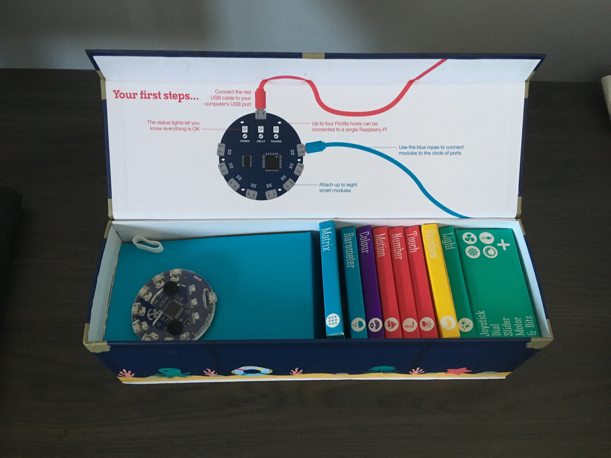
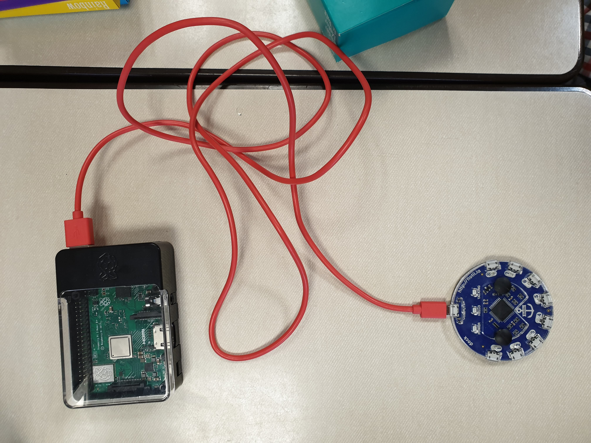
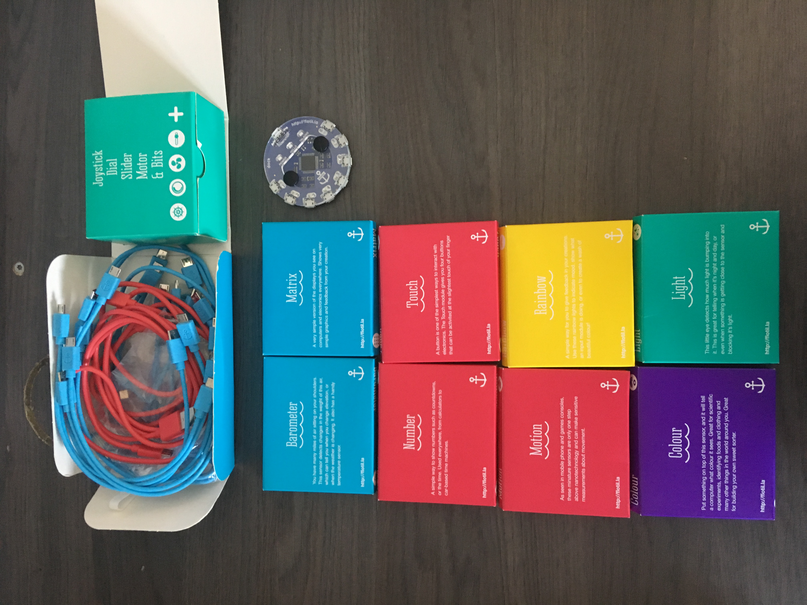
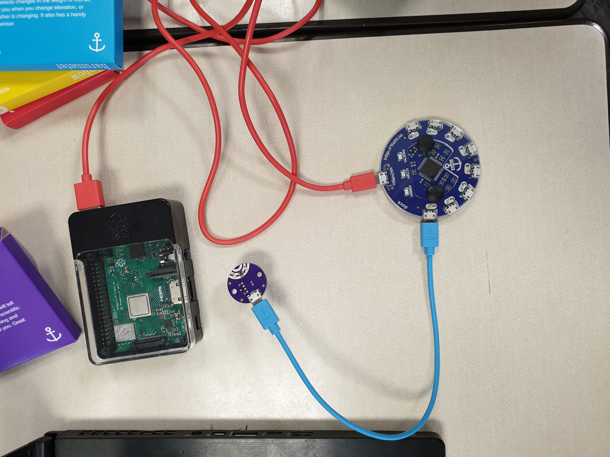

# Flotilla Mega Treasure Chest


## Table of Contents

1. Introduction
2. Installation
   1. Raspberry Pi
   2. Flotilla Dock
3. Components
4. Creating your own project
5. ...

## Introduction

To make this report, two students explored and researched Flotilla's Mega Treasure Chest in combination with a Raspberry Pi 3B+. Without any additional instructions, the task was given to make 4 examples of programs you can make using the Treasure Chest and its components.

In this report, we will cover an extended installation of the Flotilla Dock to the Raspberry Pi, an explanation of the components provided with the Mega Treasure Chest, and 4 programs we made using some of these components.

## Installation

The installation process consists of two parts. Part 1 has to be followed if the Raspberry Pi is still in it's box. If you have already plugged in and set up your Pi, you can skip this part.



### Raspberry Pi

For the Raspberry Pi steps, we will assume the Pi is assembled already. If it isn't, consult the documentation or ask an experienced person.

**Step 1:** Take the Raspberry Pi out of the box and place it on the desk, preferrably near a monitor and a power socket.

**Step 2:** Plug the Pi's power cable into the micro-USB port on the Pi, and the other side of the power cable into the nearest power socket.

**Step 3:** Plug a HDMI cable into the Pi's HDMI port and into the nearest monitor.

**Step 4:** Plug a mouse and keyboard into the rear USB ports on the Pi.

**Step 5:** Plug an ethernet cable into the Pi. This will ensure that the Pi will connect to the correct network.

If the Pi is launched and logged in, you can continue to install the Flotilla Dock to your Pi.

### Flotilla Dock

**Step 1:** Open the Flotilla Mega Treasure Chest.

**Step 2:** Take the Flotilla Dock and a red cable out of the box. You can consult the chapter "Components" or the inside of the box if you don't know what the Dock is.

**Step 3:** Connect the cable on the micro-USB side to the Dock's **computer** port, and on the USB side to any of the remaining ports on the Raspberry Pi.



**Step 4:** Open the terminal on your Pi. Type the following command into said terminal: `curl -sS get.pimoroni.com/flotilla | bash`.

**Heads up:** If you encounter an error, you might have to connect to a WiFi network instead of a wired connection. at Artevelde, you will have to connect to *Artevelde HS Open* to make this command work.

**Step 5:** Follow the instructions on the terminal. You will have to unplug and replug the Dock to the Pi.

**Step 6:** Unplug and plug the Dock back in after installation. You have to do this before you can work with it.

**Step 7:** In your preferred working directory, create a new Python file. We will use this file to check if the Dock is connected properly.

**Step 8:** Write the following code into the newly created file:

```py
import flotilla
dock = flotilla.Client()
print(dock)
```

**Step 9:** Run the file by typing the following command into the terminal:

```bash
python3 [filename].py
```

If the dock is succesfully connected, you will get a printed response in the terminal. 
You can now start using the modules and the provided Python API to create programs.

## Components



The Flotilla Mega Treasure contains 9 component boxes, a set of blue cables, a dock and a red cable. In this chapter we will briefly cover the components and what they do.

### The Dock

The Dock is the most important component in the set. It can be seen above the two blue boxes in the image.

The dock is the brain of the set. It acts as a hub to make components interact with your code and each other. You can connect up to 8 components to the dock at the same time.

### Barometer

The barometer can be compared to the sensors on the Sense Hat for the Raspberry Pi. It can sense the air pressure around you and the current temperature.

### Number

The number component is used to display all kind of messages involving numbers. As examples we can give a clock, a timer, a random number generator

### Motion

This little devices is used to track motion this can be used in a multitude of scenarios like homeautomation or track the movement of anything.

### Matrix

The matrix is a simple example of a display you can find on computers or other electronics. This can be used to show very simple graphics and feedback from your file.

### Touch

The touch component can be used to utilise touch in your project there are four touch based buttons on this component.
These can be activated with the slightest touch.

### Rainbow

This component doesn't have much of a perk on it's own but combined with other components you can make pretty cool results.

If you combine the Barometer and the Rainbow based on the air-pressure you can display different colours and these will be easy to recognize.

### Light

This component can detect the amount of light that is bumping into it the possibility to tell if it is night or day and/if something is coming closer or further away from the eye

### Colour

The colour component can be used to scan the colour that is infront of the eye this can be usefull in a sorting system based on colour.

### Wires

There are blue and red wires the red ones are used to connect the dock to the PI the blue ones are used to connect the dock to the components.

### Bits box

This is a little box in the treasure chest in this box there are multiple components. A joystick, Dial, Slider, Motor and Bits.
These are used to build a synth robot.

## Creating your own application

Creating your own application using the Flotilla Mega Treasure Chest isn't difficult. All you need is some basic Python knowledge.

Here is an example of a very simple application that reads out a colour using the Colour module:

```py
import sys
import time

import flotilla

dock = flotilla.Client()
print('Client connected')

while not dock.ready:
	pass

print('Finding module...')
colour = dock.first(flotilla.Colour)

if colour is None:
	print("No colour module found")
	dock.stop()
	sys.exit(1)
else:
	print('Found. Running...')

COLOR_INFO = "{red}, {green}, {blue}, {clear}"

try:
	while True:
		print(COLOR_INFO.format(
			red = colour.red,
			green = colour.green,
			blue = colour.blue,
			clear = colour.clear
		))
		time.sleep(0.5)

except KeyboardInterrupt:
    print("Stopping Flotilla...")
    dock.stop()
```

This may look a bit complicated if it's the first program you'll be making. We explained it in detail below so you can get started in no time. To create this application, we will use the following setup:



### Importing the required libraries

```py
import sys
import time

import flotilla
```

This piece of code imports the system and time libraries, as well as the flotilla library to communicate with the Dock.

### Creating an instance of the dock

```py
dock = flotilla.Client()
print('Client connected')

while not dock.ready:
	pass
```

Here you create an instance of the dock. If a dock is connected it will print the message "Client connected". Then it will wait until the dock is ready, before it continues with the rest of the application.

### Find the correct modules

```py
print('Finding module...')
colour = dock.first(flotilla.Colour)

if colour is None:
	print("No colour module found")
	dock.stop()
	sys.exit(1)
else:
	print('Found. Running...')
```

This part of the code will try to find the modules needed for the application to run. It will create an instance of the first required module it finds.

If this module is not found, the code will print an error message in the terminal and exit the program. Else it will display "Found. Running..." and continue the program.

### Prepare the output

```py
COLOR_INFO = "{red}, {green}, {blue}, {clear}"
```

This little piece of code prepares the string that the code will output once a colour is read from the module. This makes it easier to write the output later in the code.

### Time to read the colour

```py
try:
	while True:
		print(COLOR_INFO.format(
			red = colour.red,
			green = colour.green,
			blue = colour.blue,
			clear = colour.clear
		))
		time.sleep(0.5)
```

Now it's time to actually read the colours from the module. This part will create an endless loop. During every loop it will read the colour the sensor sees and print that using the format we created earlier. It will assign the read values to the correct part of the output string.

After every loop it will wait 0.5 seconds before running again to prevent cluttering the terminal with endless colours. You can choose whatever interval you want for this.

### Letting the application exit cleanly

```py
except KeyboardInterrupt:
    print("Stopping Flotilla...")
    dock.stop()
```

This piece of code is very important if you want your application to exit cleanly. Once you press CTRL+C, everything stops. The message "Stopping Flotilla..." will print and then the dock will be stopped before exiting the application.

### All done

Now that the application is written you can run it using the same command you used during installation, just make sure to use the correct filename.